## Overview

Under the [UN SEEA-EA](https://seea.un.org/ecosystem-accounting) framework, **ecosystem extent** accounts describe how much of each ecosystem type occurs in the accounting area (here, by **moku**), typically in physical units such as area (km²). **Ecosystem condition** accounts track biophysical indicators of ecosystem state and change over the same spatial units.

This page presents extent and condition results for the **Main Hawaiian Islands (MHI)** using **HIMARC** moku boundaries, prepared extent tables (marine and terrestrial ecosystem types), and marine and terrestrial condition indicators. Account years are **2013, 2016, and 2019** where applicable.

---

## Data sources

ECT class codes: A1 = physical state; A2 = chemical state; B1 = compositional; B2 = structural; B3 = functional; C1 = landscape. ES link: Fish = fisheries provision; Recreation = coastal recreation. n/a = link not established or data coverage incomplete.

### A.1 Terrestrial Extent Accounts

All terrestrial extent accounts use NAD83 (HARN) / Hawaiʻi State Plane Zone 3 (CRS: 2784) projection. Processing in R with terra, sf, tidyverse. Priority order in mosaicking: Agriculture Census > NWI / C-CAP > LCMAP.

| Dataset | Source / Agency | Format | Resolution | Years available | Ecosystem types |
|---------|----------------|--------|------------|-----------------|-----------------|
| USGS LCMAP | U.S. Geological Survey — Land Change Monitoring, Assessment, and Projection | Raster | 30 m | 2000–2020 | Developed, grass/shrub, tree cover, estuarine wetland, barren |
| Hawaiʻi Agriculture Land Use Census | State of Hawaiʻi / UH Hilo SDAV Lab | Vector (parcel) | — | 2015, 2020 | Cropland, pasture |
| National Wetlands Inventory (NWI) | U.S. Fish & Wildlife Service | Vector | Variable | 2018, 2022 | Freshwater wetland |
| NOAA C-CAP | NOAA Coastal Change Analysis Program | Raster | 3 m | 2010/2011 | Beaches, sand dunes |
| USGS Hawaiian Islands Coastal Vegetation Survey | U.S. Geological Survey | Vector | — | 2013–2015 | Native coastal vegetation (condition) |
| van Rees & Reed (2014); Hill (n.d.); Drexler et al. (2023) | Published literature / USGS | Various | — | Historical | Pre-settlement wetland extent reference |

### A.2 Terrestrial Condition Accounts

Only four of nine sources meeting full MHI spatial coverage also met the temporal requirement (≥2 time points): HCDP, HWMO, NOAA NCRMP, and NOAA Coral Reef Watch. Single-period sources contribute to condition description but not to directional trend assessment.

| Variable | Dataset / Source | ECT class | Years available | Ecosystem types | ES link |
|----------|-----------------|-----------|-----------------|-----------------|---------|
| Rainfall (monthly mean; peak) | Hawaiʻi Climate Data Portal (HCDP) | A2 | 1990–present | Tree cover, freshwater wetland | Fish, Recreation |
| Temperature (monthly mean; peak) | Hawaiʻi Climate Data Portal (HCDP) | A2 | 1990–present | Tree cover, freshwater wetland | Recreation |
| NDVI (Normalized Difference Vegetation Index) | Hawaiʻi Climate Data Portal (HCDP) | C1 | 2001–present | Tree cover | — |
| Area burnt | Hawaiʻi Wildfire Management Organization (HWMO) | A1 | 1999–2022 | Tree cover, grass/shrub | — |
| Dominant soil composition / order | Hawaiʻi Soil Atlas | A1 | 2010–2014 | Tree cover, freshwater wetland | Fish |
| Nutrient-holding capacity | Hawaiʻi Soil Atlas | A2 | 2010–2014 | Tree cover | Fish |
| Groundwater recharge / water budget | ScienceBase (Hawaiʻi, Oʻahu, Maui), Data.gov (Kauaʻi), OpenEI (Molokaʻi, Lānaʻi) | A2 | 1997–2010 | Tree cover, freshwater wetland | Fish |
| Alien/alien-mix species cover | USGS Hawaiʻi Land Cover & Habitat Status (HLCHS); Barton et al. (2021) | B1 | 2014 | Tree cover | — |
| Stream habitat condition; streamflow | National Fish Habitat Partnership (NFHP); Wilmot et al. (2022) | B3 | 2015 | Freshwater wetland | Fish |
| Native coastal vegetation quality; dune environment | USGS Hawaiian Islands Coastal Vegetation Survey | B1 | 2013–2015 | Beaches and dunes | Recreation |
| Tree canopy cover in developed areas | Hawaiʻi Urban Canopy GIS Data, USDA Forest Service R5 | C1 | 2019–2020 | Developed (recreation linkage) | Recreation |

### A.3 Marine Extent Accounts

Marine extent accounts are static (single baseline, 2004–2014) due to absence of MHI-wide temporal resurvey data at comparable resolution. HIMARC methods are in preparation for publication (Donovan et al., in preparation). The HIMARC dataset is available to collaborators through HIMARC data governance.

| Dataset | Source / Agency | Format | Survey period | Ecosystem types |
|---------|----------------|--------|---------------|-----------------|
| HIMARC benthic habitat classification | Hawaiʻi Monitoring and Reporting Collaborative (HIMARC). Bayesian hierarchical models integrating >11,000 in-situ SCUBA surveys with 27 environmental driver layers. | Raster (modelled) | 2004–2014 | ET 11–16 (all six marine types) |

### A.4 Marine Condition Accounts

All condition variables apply to Coral-Dominated Hard Bottom (ET 11) only. Reference period: earliest available accounting year (approximately 2010 for NOAA NCRMP data; 1985 for Coral Reef Watch).

| Condition variable | Data source | Years available | ES link |
|-------------------|-------------|-----------------|---------|
| **Group A: Abiotic — Class A1. Physical state** | | | |
| Wave power (long-term mean) | Carlson et al. (2022). *Frontiers in Marine Science*, 9, 969472. Li et al. (2022). *Remote Sens. Ecol. Conserv.*, 8(4), 521–535. | 2000–2013 | — |
| Sea surface temperature (SST); Degree heating weeks (max) | NOAA Coral Reef Watch; Donovan et al. (2021). *Science*, 372(6545), 977–980. | 1985–present (accounts: 2013, 2016, 2019) | Fish |
| Photosynthetically active radiation (PAR) / irradiance | Gove et al. (2023). *Nature*. doi:10.1038/s41586-023-06394-w | — | — |
| Wave exposure | Donovan et al. (2021). *Science*, 372(6545), 977–980. | — | — |
| **Group A: Abiotic — Class A2. Chemical state** | | | |
| Nearshore sediment | Ocean Tipping Points (OTP) project | 2000–2013 | — |
| Phosphorus flux from OSDS | State of Hawaiʻi GIS Portal; Wedding et al. (2018). *PLOS ONE*, 13(3), e0189792; Carlson et al. (2022). | 2009–2014 | — |
| Nitrogen flux from OSDS | State of Hawaiʻi GIS Portal; Wedding et al. (2018). *PLOS ONE*, 13(3), e0189792. | 2009–2014 | — |
| Total effluent from OSDS | State of Hawaiʻi GIS Portal; Wedding et al. (2018). *PLOS ONE*, 13(3), e0189792. | 2009–2014 | — |
| Chlorophyll-a | NOAA NCRMP; Donovan et al. (2021). *Science*, 372(6545), 977–980. | 2013, 2016, 2019 | Fish |
| **Group B: Biotic — Class B1. Compositional state** | | | |
| Coral cover; Adult coral density; Coral diversity; Juvenile coral density | NOAA NCRMP; Oliver et al. PIFSC Special Publication SP-20-002a. doi:10.25923/5xhp-5k12 | 2013, 2016, 2019 | Fish |
| **Group B: Biotic — Class B2. Structural state** | | | |
| Primary consumers; Secondary consumers; Planktivores; Piscivores | NOAA NCRMP | 2013, 2016, 2019 | Fish |
| **Group B: Biotic — Class B3. Functional state** | | | |
| Total disease prevalence | NOAA NCRMP | 2013, 2016, 2019 | Fish |
| Sea urchin abundance | Donovan et al. (2021). *Science*, 372(6545), 977–980. | — | Fish |
| **Group C: Landscape — Class C1. Landscape / seascape state** | | | |
| Coastal habitat modification | Ocean Tipping Points (OTP) project | 2000–2013 | — |

---

## Spatial units

Extent and condition indicators are reported by **moku**, traditional Hawaiian land and sea divisions that extend from the mountain summit (*mauka*) to the open ocean (*makai*). Terrestrial moku run from the ridgeline to the coast; marine moku extend from the coast to **30 m** depth offshore. Both layers use HIMARC boundaries and share the same moku names.

```{r}
#| label: fig-extents-spatial-units
#| fig-cap: "Spatial reporting units for the extent and condition accounts: terrestrial moku (left) and marine moku (right), both colored by county. HIMARC boundaries, Main Hawaiian Islands."
#| fig-alt: "Side-by-side maps showing terrestrial and marine moku boundaries for the Main Hawaiian Islands, colored by county."
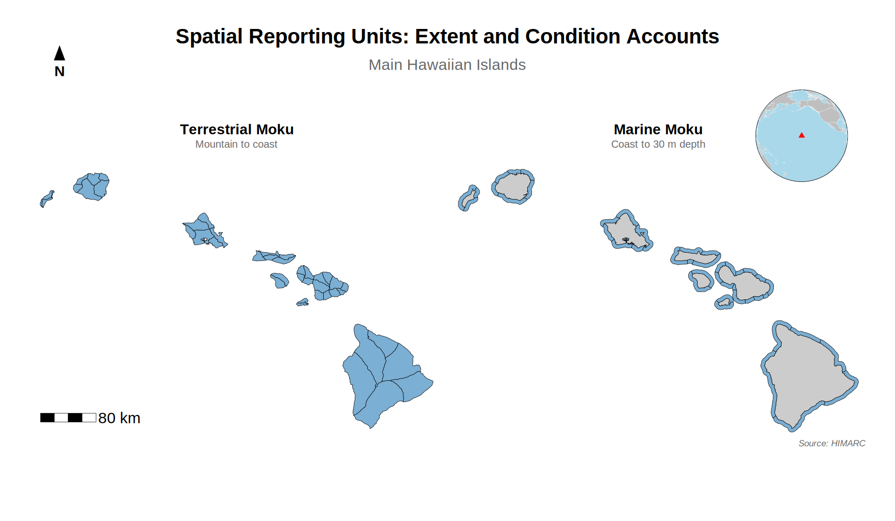
```

---

## Ecosystem extent account

The following figures summarize terrestrial extent patterns (cropland and grass/shrub), change in tree cover between **2013** and **2019**, and nearshore benthic habitat for two example marine mokus.

### Cropland and grass/shrub

```{r}
#| label: fig-extent-5
#| fig-cap: "Moku-level changes in (Top) cropland and (Bottom) grass/shrub ecosystem extent (km²) across the Main Hawaiian Islands for two accounting periods (2013–2016 and 2016–2019). Positive values indicate net gains; negative values indicate net losses."
#| fig-alt: "Bar charts of cropland and grass-shrub extent by moku for 2013 and 2019."
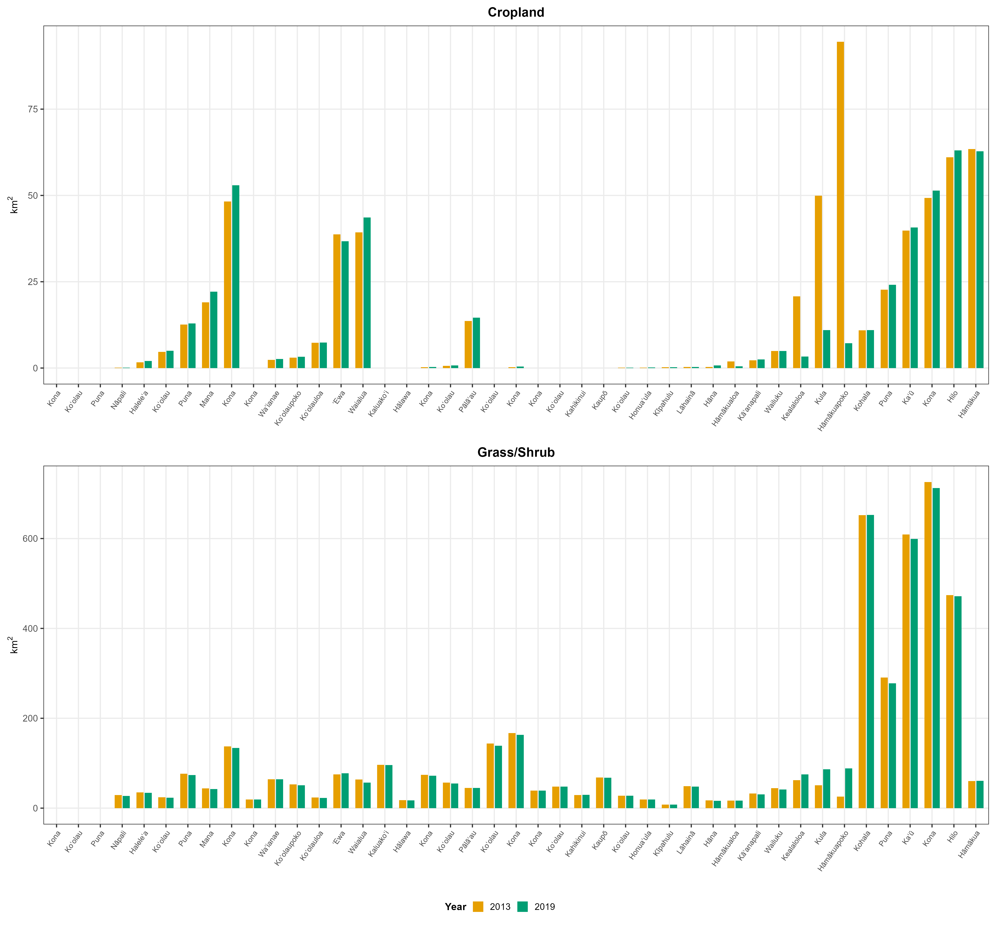
```

### Tree cover change

```{r}
#| label: fig-extent-6
#| fig-cap: "Moku-level changes in tree cover ecosystem extent, 2013–2019. The map (top) shows the spatial distribution of gains and losses across the MHI; the bar chart (bottom) quantifies net change by moku."
#| fig-alt: "Map of tree cover change 2013-2019 by moku with companion bar chart."
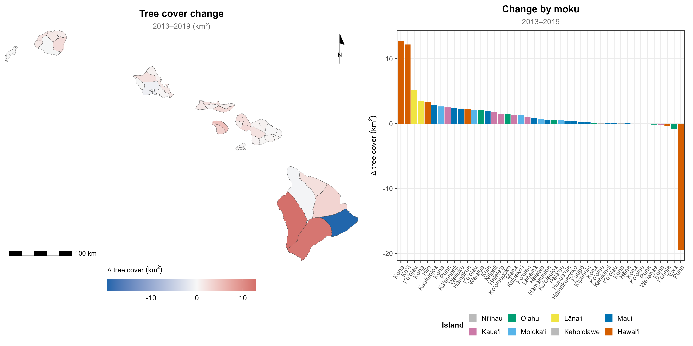
```

### Nearshore benthic habitat

```{r}
#| label: fig-extent-8
#| fig-cap: "Marine ecosystem types for Kona moku, Oʻahu (left), and Koʻolaupoko moku, Oʻahu (right). Marine ecosystems do not change over time."
#| fig-alt: "Side-by-side raster maps of benthic habitat classes for Kona Oahu and Koolaupoko marine mokus."
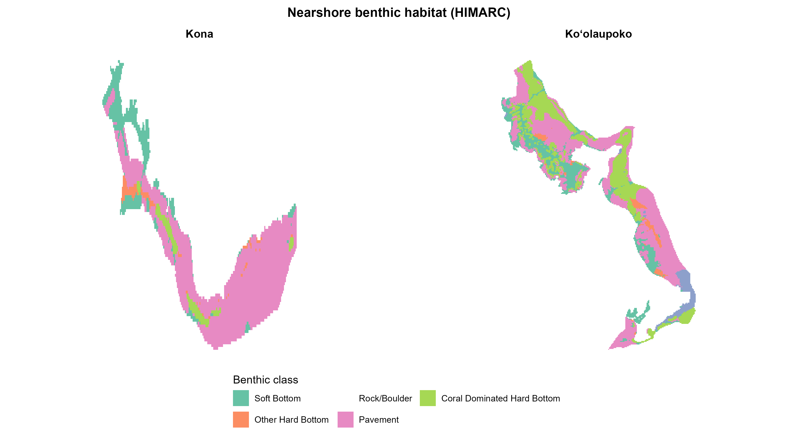
```

---

## Ecosystem condition account

The following figures summarize rainfall-linked terrestrial indicators, coral and fish functional indicators, marine abiotic composites by moku, and Ocean Tipping Points summaries.

### Rainfall change vs. 1990 baseline

```{r}
#| label: fig-condition-9
#| fig-cap: "Mean monthly rainfall (mm) for (A) tree cover and (B) freshwater wetland ecosystem types across moku in the Main Hawaiian Islands, comparing 1990 reference conditions to 2013 and 2019 accounting periods. Moku are ranked from smallest to largest decline relative to the 1990 baseline."
#| fig-alt: "Two stacked panels showing rainfall change vs 1990 for tree cover and freshwater wetland extents by moku."
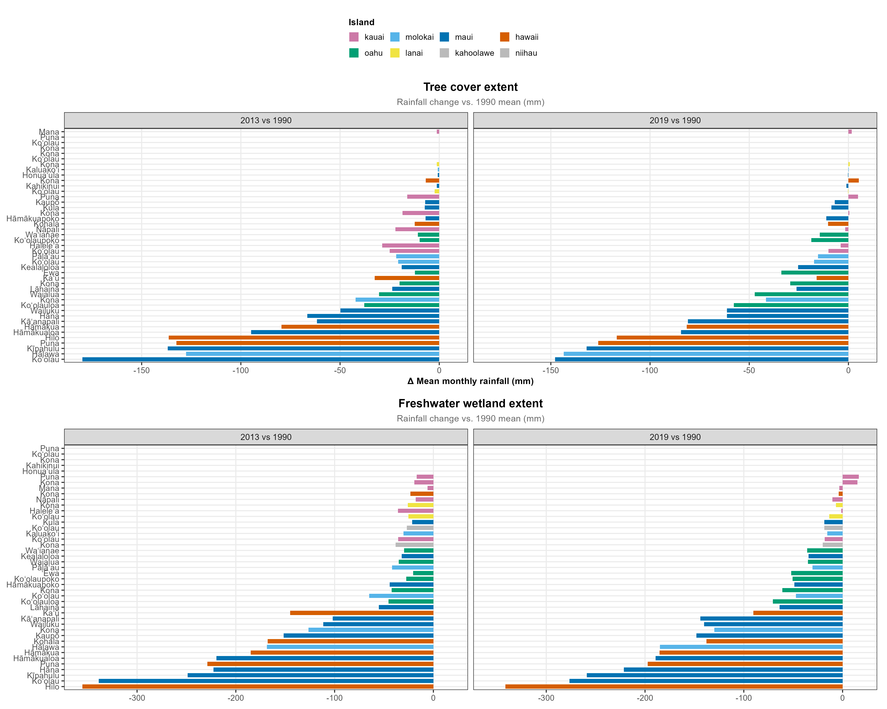
```

### Rainfall by extent type

```{r}
#| label: fig-condition-10
#| fig-cap: "Maximum and mean monthly rainfall (mm) for (A) tree cover and (B) freshwater wetland ecosystem types across moku in the Main Hawaiian Islands (excluding Niʻihau, no data), comparing 1990 reference conditions to 2013 and 2019 accounting periods."
#| fig-alt: "Faceted bar charts of max and mean monthly rainfall for tree cover and freshwater wetland by moku and year."
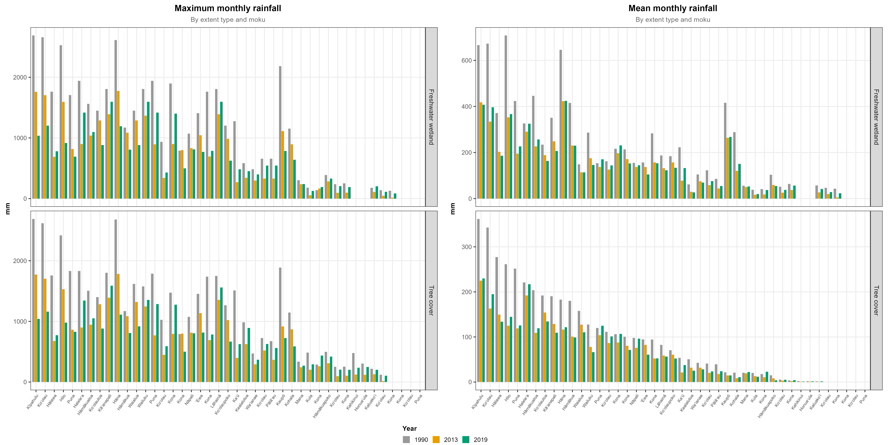
```

### Coral-related indicators

```{r}
#| label: fig-condition-11
#| fig-cap: "Coral cover, adult coral density, coral diversity (COV), and disease prevalence by moku, 2013 and 2019."
#| fig-alt: "Four-panel chart of coral cover, adult density, diversity, and disease prevalence by moku."
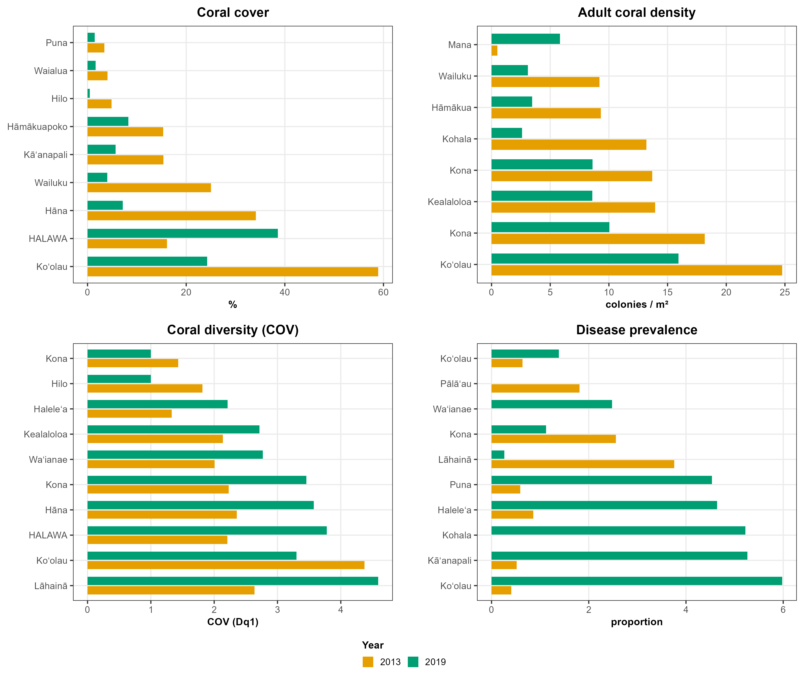
```

### Fish functional groups

```{r}
#| label: fig-condition-12
#| fig-cap: "Primary consumer, planktivore, and piscivore biomass by moku, 2013 and 2019."
#| fig-alt: "Three stacked panels of primary consumer, planktivore, and piscivore biomass by moku."
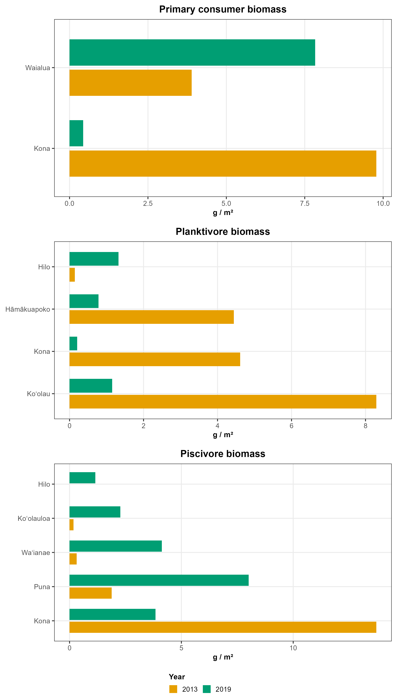
```

### Sea surface temperature and kd490

```{r}
#| label: fig-condition-14
#| fig-cap: "Mean sea surface temperature (°C) and kd490 (water clarity proxy) by marine moku, with 95% intervals, 2013, 2016, and 2019."
#| fig-alt: "Two-panel chart of SST and kd490 point estimates with error bars by moku and year."
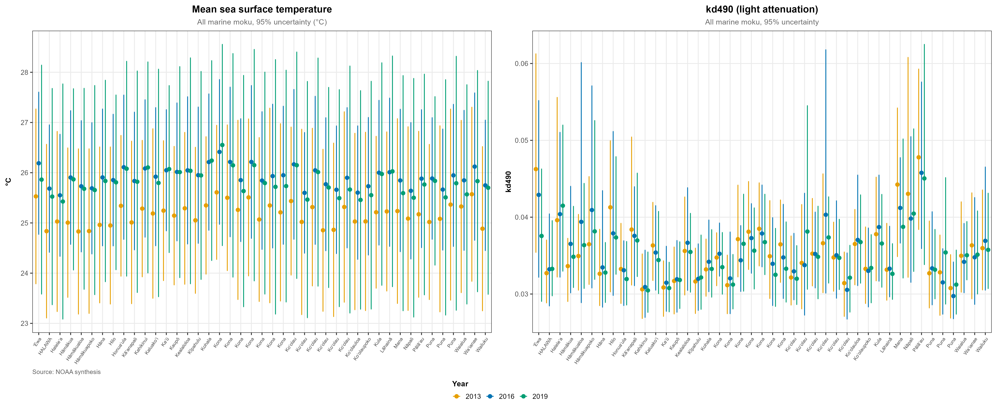
```

### PAR increase

```{r}
#| label: fig-condition-15
#| fig-cap: "Photosynthetically active radiation (PAR) increase between 2013 and 2019, by moku (W/m²)."
#| fig-alt: "Bar chart of PAR increase by moku colored by island."
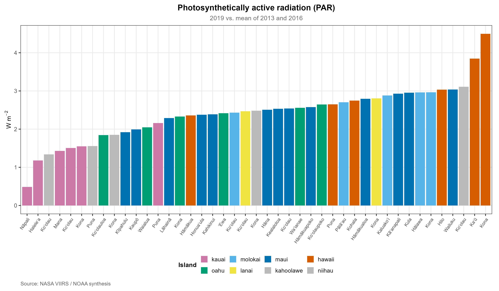
```

### Ocean tipping points

Zonal summaries (mean raster value within each marine moku) are exported to [`data/01_raw/conditions/prepared/otp_moku_zonal_mean.csv`](../data/01_raw/conditions/prepared/otp_moku_zonal_mean.csv); metadata is in `otp_moku_zonal_mean.meta.csv` in the same folder.

```{r}
#| label: fig-condition-16
#| fig-cap: "Nutrient and sediment flux, alongside mean wave power and modified percentage of coastline, by marine moku."
#| fig-alt: "Faceted maps of OTP stress layers summarized as means within marine moku polygons."
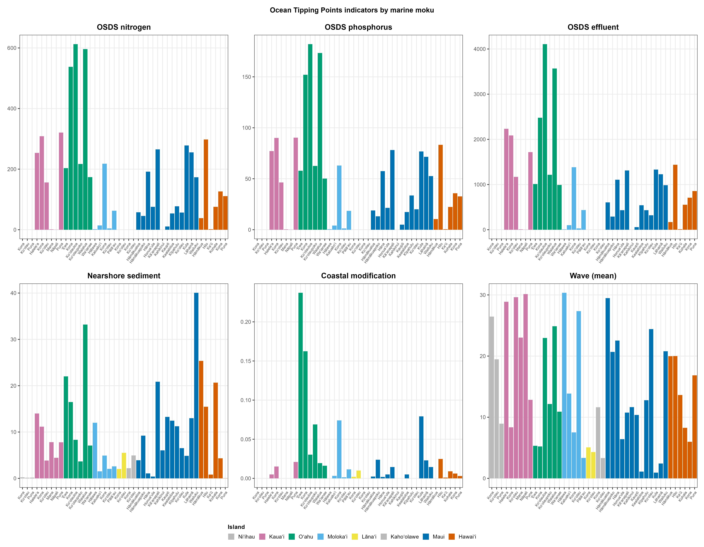
```

---

## Methods notes

- **Extent** tables are built from prepared CSVs, joined to moku geometries; outputs: `data/03_processed/extents/`.
- **Condition** indicators use a long schema (indicator × year × moku, with uncertainty where available), joined to mokus; outputs: `data/03_processed/conditions/`.
- **OTP** summaries use `terra::extract` with `fun = mean` and `na.rm = TRUE` over marine moku polygons, consistent with the CSV metadata sidecar.

---

## Reproducibility

### Data lineage

| Step | What happens | Key files |
|------|--------------|-----------|
| **1. Raw inputs** | Extent CSVs, condition CSVs, OTP rasters, HIMARC moku and benthic raster | `data/01_raw/extents/`, `data/01_raw/conditions/`, `data/01_raw/spatial_units/` |
| **2. Load & join extents** | `load_et_areas_*`, `combine_et_areas`, `join_mokus_extents` | [`R/prep_extents.R`](../R/prep_extents.R) |
| **3. Export extents** | GeoPackage and CSV | `data/03_processed/extents/` |
| **4. Extent figures** | `generate_extent_figs()` (uses `00_theme_account_figs.R`) | `outputs/figs/extents/` |
| **5. Load & join conditions** | Loaders, `combine_conditions`, `join_mokus_conditions` | [`R/prep_conditions.R`](../R/prep_conditions.R) |
| **6. Export conditions** | GeoPackage and CSV | `data/03_processed/conditions/` |
| **7. OTP zonal export** | `export_otp_moku_zonal_stats()` | `data/01_raw/conditions/prepared/otp_moku_zonal_mean.csv` |
| **8. Condition figures** | `generate_all_condition_figs()` — report figures for this page, plus abiotic/disease PNGs for [`notebooks/pipeline_report.qmd`](../notebooks/pipeline_report.qmd) | `outputs/figs/conditions/` |
| **9. Render website** | `quarto::quarto_render()` | `website/_site/` |

The full pipeline is orchestrated by [`targets`](https://docs.ropensci.org/targets/) in `_targets.R`. The interactive pipeline dependency graph is on the [home page](index.qmd#data-reproducibility).

### Commands

```r
targets::tar_make(names = c(
  "export_extents_gpkg", "export_extents_csv", "extents_figs",
  "export_conditions_gpkg", "export_conditions_csv",
  "export_otp_moku_zonal", "conditions_figs"
))
```

```r
targets::tar_make()
```

Extent and condition figure code lives in [`R/prep_extents.R`](../R/prep_extents.R), [`R/prep_conditions.R`](../R/prep_conditions.R), and [`R/00_theme_account_figs.R`](../R/00_theme_account_figs.R).
