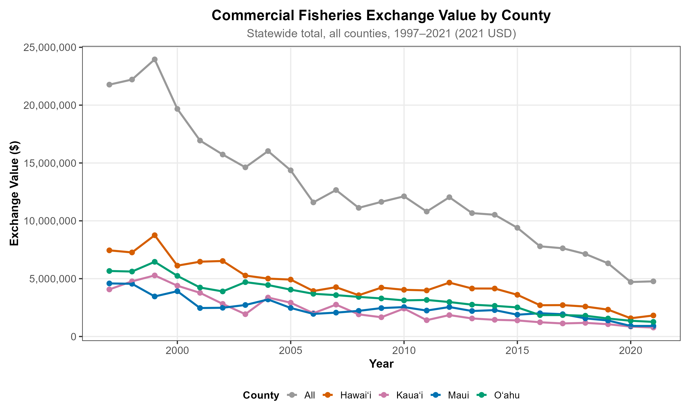
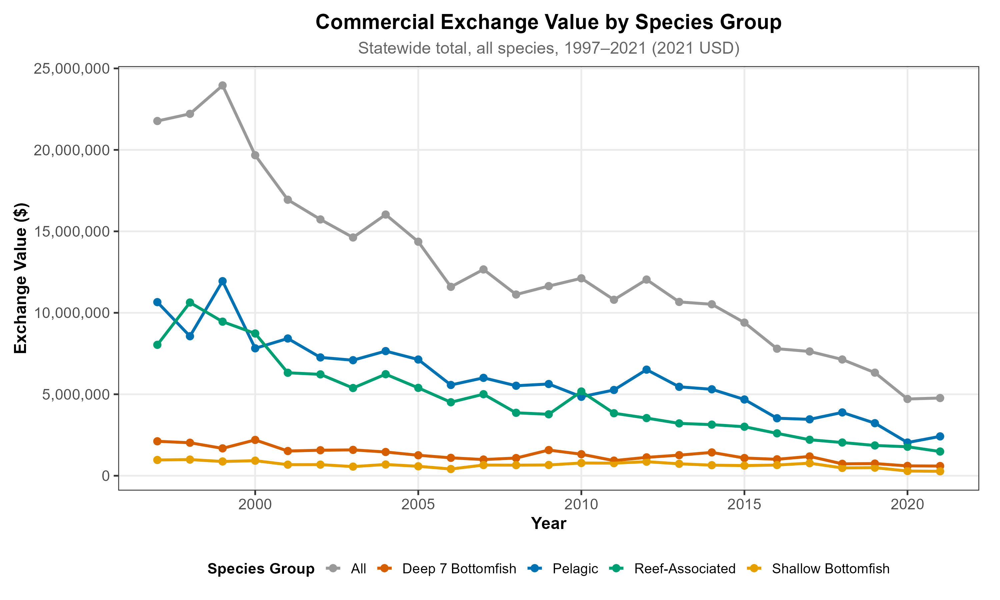
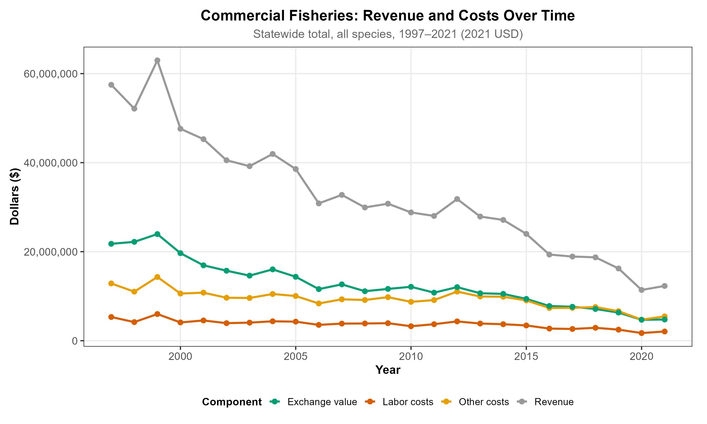
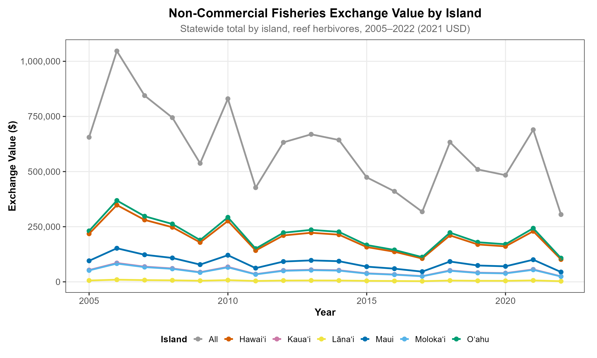
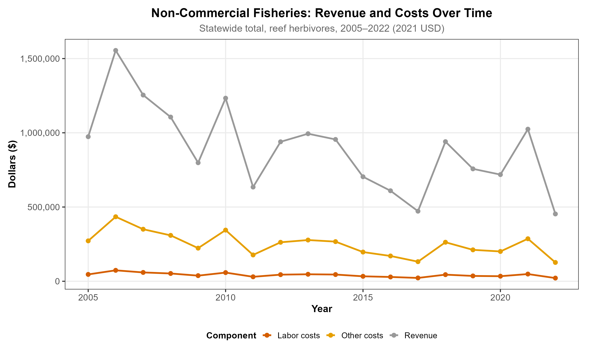
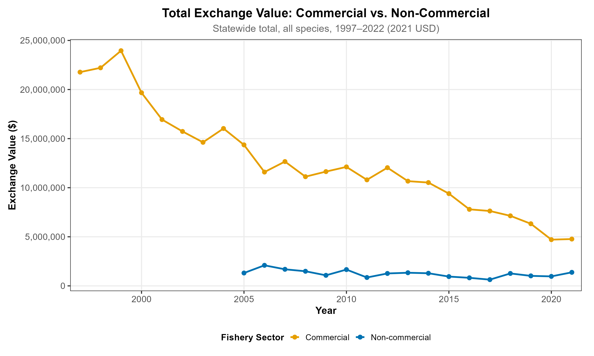
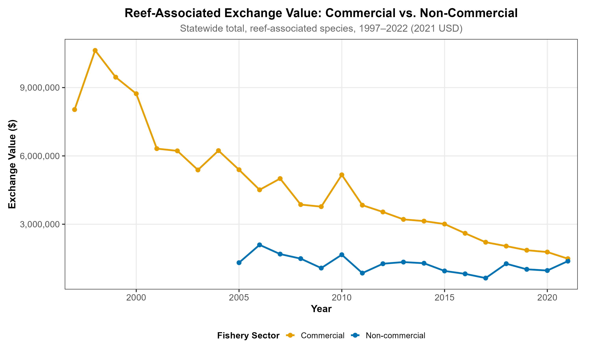

## Overview

The **fisheries exchange value (EV) account** quantifies the monetary value of fisheries ecosystem services flowing to society. Following the [UN SEEA-EA](https://seea.un.org/ecosystem-accounting) framework, exchange value is defined as:

$$\text{EV} = \text{Gross Revenue} - \text{Marginal Costs}$$

where marginal costs include both labor and non-labor (fuel, gear, bait) operating costs. This measure captures the residual value attributable to the ecosystem — the amount remaining after compensating all inputs of production.

**Commercial fisheries** exchange values are calculated at the DAR catch area level (83 reporting areas) across four species groups: Deep 7 Bottomfish, Shallow Bottomfish, Reef-Associated, and Pelagic species. Values are drawn from the Hawaiʻi Division of Aquatic Resources (HDAR) Commercial Marine Landings database (1997–2021).

**Non-commercial fisheries** exchange values are calculated at the island level for six main islands, covering reef herbivores captured through the Marine Recreational Information Program (MRIP) Hawaiʻi Marine Recreational Fishing Survey (2005–2022).

All values are inflation-adjusted to **2021 USD** using the Bureau of Labor Statistics Consumer Price Index (CPI, FRED series).

---

## Data Sources

*From Appendix A.5 of the Pew Marine Fellowship Final Report.* Commercial landings: 1997–2021, HDAR CML. Non-commercial landings: 2005–2022, MRIP / HMRFS (reef herbivores only, statewide totals). All monetary values expressed in 2021 real USD.

| Dataset | Source / Agency | Format | Years | Use in accounts |
|---------|----------------|--------|-------|-----------------|
| HDAR Commercial Marine License (CML) data | Hawaiʻi Division of Aquatic Resources | Tabular | 1997–2021 | Commercial landings by species group, DAR catch area, year |
| HMRFS / MRIP survey data | Marine Recreational Information Program (MRIP), NOAA Fisheries / HDAR | Tabular | 2005–2022 | Non-commercial reef herbivore landings (statewide) |
| PacFIN landing prices | Pacific Fisheries Information Network (PacFIN) | Tabular | Variable to 2022 | Landing-level prices for WAP calculation; commercial species groups |
| TNC retail price dataset | The Nature Conservancy (2016) | Tabular | 2016 | Retail prices for species without PacFIN coverage (converted via markup multiplier) |
| NOAA Hawaiʻi Small Boat Survey (SBS) | NOAA Fisheries | Tabular | 2021 | Fixed, variable, and labor cost estimation for EV calculation |
| McCoy et al. (2018) CPUE and island weights | McCoy, K. et al. (2018). *PLoS ONE*. | Published | — | Island-level distribution weights for non-commercial landings; CPUE for labor cost |
| Grafeld et al. (2017) price multiplier | Grafeld, S. et al. (2017). *PLoS ONE*. | Published | — | Retail-to-landing markup validation for reef fish |

---

## Spatial Units

Commercial and non-commercial fisheries exchange values are reported at different spatial scales reflecting the resolution of the underlying catch data.

**Commercial fisheries** use the 83 Division of Aquatic Resources (DAR) catch area boundaries that intersect the main Hawaiian Islands. These are the official reporting areas for the HDAR Commercial Marine Landings database.

**Non-commercial fisheries** are reported at the island level, apportioned to counties based on MRIP survey data. The six main islands map to four counties: Kauaʻi, Honolulu (Oʻahu), Maui (Maui, Molokaʻi, Lānaʻi), and Hawaiʻi.

```{r}
#| fig-alt: "Side-by-side maps showing the spatial reporting units for commercial fisheries (DAR catch areas, left) and non-commercial fisheries (island/county zones, right), with a globe inset showing the location of the Hawaiian Islands."
knitr::include_graphics("../outputs/figs/fisheries_exchange_values/fisheries_spatial_units_web.svg")
```

---

## Commercial Exchange Values

Commercial exchange values are computed as gross revenue minus total marginal costs (labor + non-labor operating costs), inflation-adjusted to 2021 USD. See [Methods Notes](#methods-notes) for species group definitions and cost estimation details.

### By County

Commercial EV summed across all species groups and DAR catch areas, aggregated by county and year. The statewide total ("All") is shown in grey.

```{r}
#| fig-alt: "Line chart showing commercial fisheries exchange value by county from 1997 to 2021. Hawaiʻi County generally leads, with all counties showing decline from mid-2000s peaks."

```

### By Species Group

Commercial EV disaggregated by the four primary species groups. Pelagic species and reef-associated fish represent the highest commercial EV across the account period.

```{r}
#| fig-alt: "Line chart of commercial exchange value by species group (Deep 7 Bottomfish, Shallow Bottomfish, Reef-Associated, Pelagic) from 1997 to 2021."

```

### Revenue and Costs Over Time

Gross revenue, marginal costs (labor and non-labor), and exchange value tracked annually across all species groups and DAR catch areas.

```{r}
#| fig-alt: "Line chart tracking commercial revenue, labor costs, other costs, and exchange value from 1997 to 2021."

```

---

## Non-Commercial Exchange Values

Non-commercial exchange values cover reef herbivores captured in the MRIP recreational fishing survey. Labor costs use county-level BLS wages and species-specific catch-per-unit-effort (CPUE) rates. All species in this category map entirely to reef habitat under the FSOET allocation.

### By Island

Non-commercial EV by island and year. The statewide total ("All") is shown in grey.

```{r}
#| fig-alt: "Line chart of non-commercial fisheries exchange value by island (Hawai'i, Kaua'i, Lana'i, Maui, Moloka'i, O'ahu, and All statewide) from 2005 to 2022."

```

### Revenue and Costs Over Time

Gross revenue, labor costs, and exchange value tracked annually for reef herbivore species.

```{r}
#| fig-alt: "Line chart showing non-commercial revenue, labor costs, and other costs from 2005 to 2022."

```

---

## Commercial vs. Non-Commercial Comparison

### All Species — Total EV

Combined statewide commercial and non-commercial exchange value over the overlapping period. Note the different temporal coverage of each sector.

```{r}
#| fig-alt: "Line chart comparing total commercial and non-commercial exchange value over time."

```

### Reef-Associated Only

Commercial reef-associated EV vs. non-commercial reef herbivore EV — the two sectors that share the same reef ecosystem type.

```{r}
#| fig-alt: "Line chart comparing commercial reef-associated and non-commercial reef herbivore exchange value over time."

```

::: {.callout-note}
## Species Coverage: Commercial vs. Non-Commercial Reef Fish

This figure compares commercial and non-commercial EV for reef-associated fish only. The commercial reef-associated fish category contains over 85 different species. Meanwhile, our non-commercial reef associated fish category contains only 5-8 of these species. This explains the large gap between commercial and non-commercial reef fisheries value. Even with this considerable underestimation of non-commercial reef species, non-commercial reef fisheries EV trailed commercial EV by only about $0.5 million by 2021. The gap has narrowed over the period as commercial landings have declined more steeply than non-commercial catch.
:::

<details>
<summary>Non-commercial reef-associated species (8 species included in this analysis)</summary>

Convict tang, Bluespine unicornfish, Goldring surgeonfish, Spectacled parrotfish, Stareye parrotfish, Redlip parrotfish, Palenose parrotfish, Uhu (all other parrotfish)

</details>

<details>
<summary>Commercial reef-associated species (85+ species)</summary>

Convict tang, Unicornfish, Sleek Unicornfish, Naso Tang/Orangespine Unicornfish, Stareye Parrotfish, Palenose Parrotfish, Parrotfish (Misc.), Great Barracuda, Heller's Barracuda, Japanese Barracuda, Moray Eel (Misc.), Gymnothorax spp., Conger Eel, Garden Eel, White Eel, Orange Goatfish, White Saddle Goatfish, Sidespot Goatfish, Doublebar Goatfish, Bandtail Goatfish, Yellowfin Goatfish, Square-Spot Goatfish, Yellowstripe Goatfish, Blue Goatfish, Yellowsaddle Goatfish, Flathead Grey Mullet, Striped Mullet, Australian Mullet, Summer Mullet, False Mullet, Sharpnose Mullet, Garfish, Needlefish, Hawaiian Flagtail, Mountainbass, Perch, Milkfish, Hawaiian Ladyfish, Glasseye Snapper, Hawaiian Bigeye, Eagle Ray, Sting Ray, Hage (Big Island), Triggerfish, Hawaiian Silverside, Ballyhoo, Halfbeak, Moorish Idol, Blackspot Sergeant, Damselfish, Millet Butterflyfish, Hawaiian Sergeant, Sergeant Major, Sardine, Threadfin, Bigeye Emperor, Anchovy, Chub, Rudderfish, Scorpionfish, Cornetfish, Stickfish, Trumpetfish, Filefish, Bonefish, Balloonfish, Porcupinefish, Pufferfish, Flatfish, Flounder, Delicate Roundherring, Cardinalfish, Ocean Sunfish, Slender Sunfish, Japanese Mackerel, Tilapia, Hawkfish, Spotted Knifejaw, Barred Knifejaw, Gold-spot Herring, Bigeye Scad, Bigeye Scad (Juvenile), Mackerel Scad, Butternose, Mackerel, Forktail Snapper (Use Code 123), Bluestripe Snapper, Blacktail Snapper, Golden Perch, Peacock Grouper, Royal Sea Bass, Hawaiian Squirrelfish, Indianfish, Squirrelfish (Holocentridae), Myripristis spp., Longjaw Squirrelfish, Brown Surgeonfish, Lavender Tang, Blueline Surgeonfish, Whitebar Surgeonfish, Olive Tang, Orangeband Surgeonfish, Yellow Tang, Achilles Tang, Eyestripe Surgeonfish, Ringtail Surgeonfish, Yellowfin Surgeonfish, Whitespotted Surgeonfish, Black Surgeonfish, Hawaiian Hogfish, Tableboss, Wrasse (Misc.), Blackstripe Coris Wrasse, Wrasse (Thalassoma spp.), Cigar Wrasse, Mongoose Fish, Peacock Razorfish, Pearl Wrasse, Humphead Wrasse, Napoleon Wrasse, Ringtail Wrasse

</details>

---

## Spatial Distribution of Commercial Exchange Value

### Change in Spatial Distribution, 2014 and 2021

Side-by-side choropleth maps showing gross commercial fisheries exchange value by DAR catch area for 2014 and 2021, illustrating the spatial redistribution of fisheries value over the account period. Areas with no reported landings are shown in grey.

```{r}
#| fig-alt: "Side-by-side maps showing commercial EV by DAR catch area for 2014 (left) and 2021 (right), with a shared color scale. Areas with higher EV are shown in brighter colors."
knitr::include_graphics("../outputs/figs/fisheries_exchange_values/comm_ev_change_map_web.svg")
```

---

## Methods Notes

**Species group definitions:**

| Group | Species | Ecosystem type |
|-------|---------|----------------|
| Deep 7 Bottomfish | *ʻōpakapaka*, *ehu*, *onaga*, *kalekale*, *gindai*, *lehi*, *hapu'upu'u* | Open ocean |
| Shallow Bottomfish (SBF) | Jacks, other bottomfish, seamount groundfish | Inshore reef, inshore non-reef, and open ocean (FSOET weights) |
| Reef-Associated | Inshore reef species | Inshore reef |
| Pelagic | *ahi*, *ono*, *mahimahi*, *marlin* | Open ocean |

**Ecosystem type attribution:** The Shallow Bottomfish group is distributed across three ecosystem types — inshore reef, inshore non-reef, and open ocean — using the MHI Fish Species over Ecosystem Type (FSOET) dataset, which assigns each species group a probability of extraction within a given ecosystem type based on habitat use, migration patterns, and fishing location data. All other groups map entirely to one ecosystem type.

**Labor cost methodology:** Labor costs per pound are estimated as ²⁄₃ of the mean county-level BLS hourly wage divided by species-specific CPUE (lbs per hour fished; McCoy et al., 2018), weighted by the county's share of total landings for each species group.

---

## Reproducibility

### Data lineage

| Step | What happens | Key files |
|------|-------------|-----------|
| **1. Raw inputs** | Validated input workbook from Ela Ural | `data/01_raw/fisheries_exchange_values/trace_raw.xlsx` |
| **2. Rebuild EV workbook** | `rebuild_ev_master_finale()` reads `trace_raw.xlsx` and writes the authoritative EV workbook used by figures | `data/02_interim/fisheries_exchange_values/ev_master_finale_rebuilt.xlsx` |
| **3. Load** | `load_raw_fisheries()` reads commercial landings, prices, costs, wages, CPI, and spatial crosswalks | `R/prep_uses_fisheries.R` |
| **4. Compute commercial EV** | `compute_comm_ev()` calculates EV per DAR area × year × species group | `R/prep_uses_fisheries.R` |
| **5. Compute non-commercial EV** | `compute_noncomm_ev()` calculates EV per island × year | `R/prep_uses_fisheries.R` |
| **6. Export tables** | Writes processed CSVs | `data/03_processed/fisheries_exchange_values/` |
| **7. Generate figures** | `generate_fisheries_ev_figs()` produces all EV charts using `ev_master_finale_rebuilt.xlsx` | `outputs/figs/fisheries_exchange_values/` |
| **8. Generate maps** | `generate_fisheries_spatial_maps()` and `generate_ev_change_maps()` produce spatial figures | `outputs/figs/fisheries_exchange_values/` |
| **9. Render website** | `quarto::quarto_render()` builds this site | `website/_site/` |

The full pipeline is orchestrated by [`targets`](https://docs.ropensci.org/targets/) in `_targets.R`. All steps are reproducible and re-run only when upstream inputs change. The interactive pipeline dependency graph is on the [home page](index.qmd#data-reproducibility).

### Scripts and commands

The EV workbook rebuild is documented in:

- `scripts/fisheries_exchange_values/rebuild_ev_master_finale_from_trace_raw.R` — reads `trace_raw.xlsx` and writes `ev_master_finale_rebuilt.xlsx`; refactored into the pipeline as `rebuild_ev_master_finale()` in `R/prep_uses_fisheries.R`

To reproduce fisheries outputs from the project root:

```r
targets::tar_make()
```
