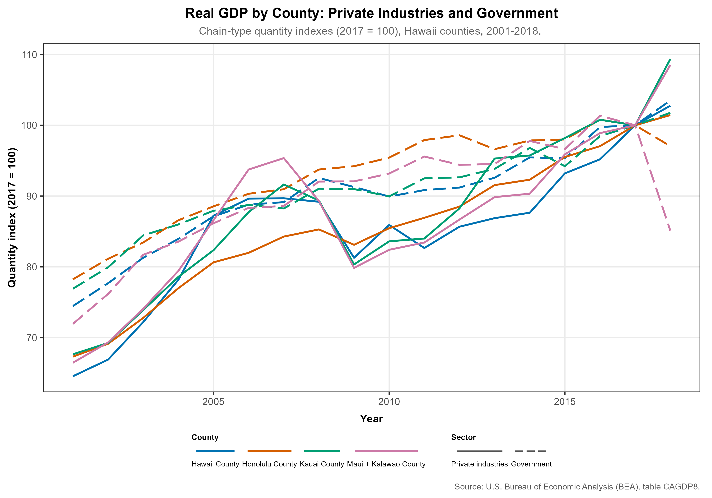

## Overview

Ecosystem accounts complement conventional economic statistics such as gross domestic product (GDP). This page summarizes **real GDP quantity indexes** for Hawaiʻi’s four counties, split between **private industries** and **government and government enterprises**, from the U.S. Bureau of Economic Analysis (BEA) regional economic accounts.

The series are **chain-type quantity indexes** with **2017 = 100**. They describe the *volume* of economic activity (not nominal dollars) and are useful for comparing trends across counties and sectors alongside physical ecosystem accounts elsewhere on this site.

---

## Data source

| Dataset | Source | Table | Years | Geography |
|---------|--------|-------|-------|-----------|
| Real GDP by county and industry | U.S. Bureau of Economic Analysis (BEA) | CAGDP8 — chained dollars | 2001–2018 | Hawaiʻi, Honolulu, Kauaʻi, Maui + Kalawao counties |

The pipeline reads Kirsten’s prepared Excel workbook (`bea_hi_county_gdp_private_gov_2001_2018_cagdp8.xlsx`), extracts **LineCode 2** (private industries) and **LineCode 83** (government and government enterprises), and exports a long-format CSV for reuse.

**Note:** BEA combines **Kalawao** with **Maui** in county-level tables; the chart label reflects “Maui + Kalawao County.”

---

## County real GDP: private vs government

```{r}
#| fig-cap: "Chain-type quantity indexes for real GDP (2017 = 100) by Hawaiʻi county, 2001–2018. Color indicates county; line type distinguishes private industries from government and government enterprises. Source: BEA table CAGDP8."
#| fig-alt: "Multi-line chart of real GDP quantity indexes from 2001 to 2018 for four Hawaiʻi counties, with solid lines for private industries and dashed lines for government."

```

---

## Processed data

The tabular extract used for the figure is written to:

`data/03_processed/natural_capital_economic_indicators/bea_hi_county_gdp_private_gov_2001_2018_cagdp8_processed.csv`

Columns include year, county FIPS, county name, BEA line code, sector label, quantity index value, and measure description.

---

## Methods notes

- **Quantity index:** BEA defines the index as a chain-weighted measure of real GDP with a reference year of 2017 (index level 100 in that year). Interpret changes as *relative* growth from the base, not as level comparisons in dollars.
- **Sectors shown:** “Private industries” aggregates all private value added at the county level in this table; “Government and government enterprises” is the separate government component published in CAGDP8.
- **Reproduction:** `targets::tar_make()` builds the CSV and figure via `generate_natural_capital_economic_indicator_figs()` in `R/prep_natural_capital_economic_indicators.R`.
